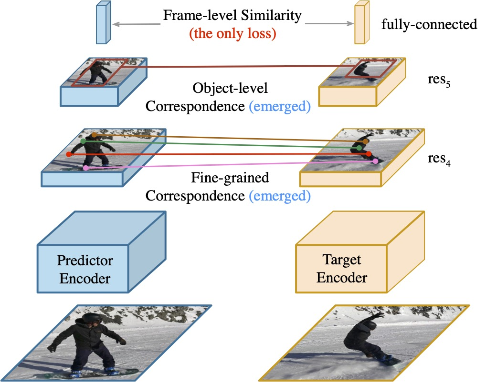
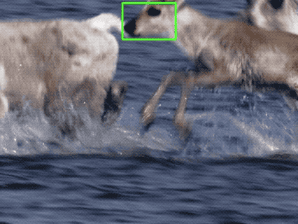

# VFS

This repository is the official implementation for VFS introduced in the paper:

[Rethinking Self-Supervised Correspondence Learning: A Video Frame-level Similarity Perspective](https://arxiv.org/abs/2103.17263)
<br>
[Jiarui Xu](https://jerryxu.net), [Xiaolong Wang](https://xiaolonw.github.io/)
<br>
ICCV 2021 (**Oral**)

The project page with video is at https://jerryxu.net/VFS/.

<div align="center">

</div>

## Citation

If you find our work useful in your research, please cite:

```latex
@article{xu2021rethinking,
  title={Rethinking Self-Supervised Correspondence Learning: A Video Frame-level Similarity Perspective},
  author={Xu, Jiarui and Wang, Xiaolong},
  journal={arXiv preprint arXiv:2103.17263},
  year={2021}
}
```

## Environmental Setup

The codebase is implemented based on the awesome [MMAction2](https://github.com/open-mmlab/mmaction2), please follow the [getting started](https://mmaction2.readthedocs.io/en/latest/getting_started.html) in MMAction2 to setup the environment.

We also provide the Dockerfile under `docker/` folder.

## Model Zoo

### Fine-grained correspondence

<p float="left">


</p>

| Backbone  | Config                                              | J&F-Mean | J-Mean | F-Mean | Download          |
| --------- | --------------------------------------------------- | -------- | ------ | ------ | ----------------- |
| ResNet-18 | [cfg](configs/r18_nc_sgd_cos_100e_r2_1xNx8_k400.py) | 66.7     | 64.0   | 69.5   | [pretrain ckpt]() |
| ResNet-50 | [cfg](configs/r50_nc_sgd_cos_100e_r5_1xNx2_k400.py) | 69.5     | 67.0   | 72.0   | [pretrain ckpt]() |

Note: We report the accuracy of the last block in res4, to evaluate all blocks, please pass `--options test_cfg.all_blocks=True`.
The reproduced performance in this repo is slightly higher than reported in the paper.

### Object-level correspondence

<p float="left">



</p>

TODO:

| Backbone  | Config | Precision <br> (w/o fine-tune) | Success <br> (w/o fine-tune) | Precision <br> (w/ fine-tune) | Success <br> (w/ fine-tune) | Download                                    |
| --------- | ------ | ------------------------------ | ---------------------------- | ----------------------------- | --------------------------- | ------------------------------------------- |
| ResNet-18 |        |                                |                              |                               |                             | [pretrain ckpt]() &#124; [fine-tune ckpt]() |
| ResNet-50 |        |                                |                              |                               |                             | [pretrain ckpt]() &#124; [fine-tune ckpt]() |

## Data Preparation

We use [Kinetics-400](https://github.com/cvdfoundation/kinetics-dataset) for self-supervised correspondence pretraining.

The fine-grained correspondence is evaluated on [DAVIS2017](https://davischallenge.org/davis2017/code.html) w/o any fine-tuning.

The object-level correspondence is evaluated on [OTB-100](http://cvlab.hanyang.ac.kr/tracker_benchmark/index.html).
The numbers in Sec 4.3 (Ablation Study) are under w/o fine-tuning setting.
The numbers in Sec 4.4 (Comparison with SOTA) are under linear probing setting (fine-tuning an extra linear layer).
In this repo, both of them are reported.

The overall file structure is as followed:

```
vfs
├── mmaction
├── tools
├── configs
├── data
│   ├── kinetics400
│   │   ├── videos_train
│   │   │   ├── kinetics400_train_list_videos.txt
│   │   │   ├── train
│   │   │   │   ├── abseiling/
│   │   │   │   ├── air_drumming/
│   │   │   │   ├── ...
│   │   │   │   ├── yoga/
│   │   │   │   ├── zumba/
│   ├── davis
│   │   ├── DAVIS
│   │   │   ├── Annotations
│   │   │   │   ├── 480p
│   │   │   │   │   ├── bike-packing/
│   │   │   │   │   ├── ...
│   │   │   │   │   ├── soapbox/
│   │   │   ├── ImageSets
│   │   │   │   ├── 2017/
│   │   │   │   ├── davis2017_val_list_rawframes.txt
│   │   │   ├── JPEGImages
│   │   │   │   ├── 480p
│   │   │   │   │   ├── bike-packing/
│   │   │   │   │   ├── ...
│   │   │   │   │   ├── soapbox/
│   ├── otb
│   │   ├── Basketball/
│   │   ├── ...
│   │   ├── Woman/
│   ├── GOT-10k
│   │   ├── train
│   │   │   ├── GOT-10k_Train_000001/
│   │   │   ├── ...
│   │   │   ├── GOT-10k_Train_009335/
```

The instructions for preparing each dataset are as followed.

### Kinetics-400

Please follow the documentation [here](https://mmaction2.readthedocs.io/en/latest/supported_datasets.html#kinetics-400-600-700) to prepare the Kinetics-400.

### DAVIS2017

DAVIS2017 dataset could be downloaded from the [offical website](https://davischallenge.org/davis2017/code.html). We use the 480p validation set for evaluation.

```bash
# download data
wget https://data.vision.ee.ethz.ch/csergi/share/davis/DAVIS-2017-trainval-480p.zip
# download filelist
wget xxx
```

Then please unzip and place them according to the file structure above.

### OTB-100

The OTB-100 frames and annotations will be downloaded automatically.

### GOT-10k

GOT-10k dataset could be downloaded from the [offical website](http://got-10k.aitestunion.com/downloads).

Then please unzip and place them according to the file structure above.

## Run Experiments

### Pretrain

```bash
./tools/dist_train.sh ${CONFIG} ${GPUS}
```

We use 2 and 8 GPUs for ResNet-18 and ResNet-50 models respectively.

### Inference

To run the following inference and evaluation, we need to convert the pretrained checkpoint into the same format as torchvision [ResNet](https://github.com/pytorch/vision/blob/master/torchvision/models/resnet.py).

```bash
python tools/convert_weights/convert_to_pretrained.py ${PRETRAIN_CHECKPOINT} ${BACKBONE_WEIGHT}
```

#### Evaluate fine-grained correspondence on DAVIS2017

```bash
./tools/dist_test.sh ${CONFIG} ${BACKBONE_WEIGHT} ${GPUS}  --eval davis
```

You may pass `--options test_cfg.save_np=True` to save memory.

#### Evaluate object-level correspondence

##### w/o fine-tune

```bash
python projects/siamfc-pytorch/train_siamfc.py ${CONFIG} --pretrained ${BACKBONE_WEIGHT}  --options extra_conv=False
```

##### w/ fine-tune

ResNet-18:

```bash
 python projects/siamfc-pytorch/train_siamfc.py ${CONFIG} --pretrained ${BACKBONE_WEIGHT}
```

ResNet-50:

```bash
 python projects/siamfc-pytorch/train_siamfc.py ${CONFIG} --pretrained ${BACKBONE_WEIGHT} --options out_scale=0.00001 out_channels=2048
```

The results will be saved in `work_dirs/${CONFIG}/siamfc`.

## Acknowledgements

The codebase is based on [MMAction2](https://github.com/open-mmlab/mmaction2).
The fine-grained correspondence inference and evaluation follows [TimeCycle](https://github.com/xiaolonw/TimeCycle), [UVC](https://github.com/Liusifei/UVC) and [videowalk](https://github.com/ajabri/videowalk).
The object-level correspondence inference and evaluation is based on [SiamFC-PyTorch](https://github.com/huanglianghua/siamfc-pytorch).
