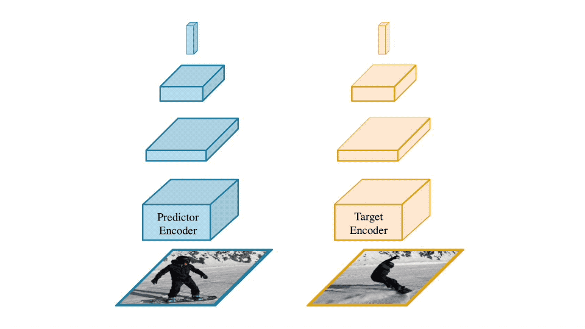

# Rethinking Self-Supervised Correspondence Learning: A Video Frame-level Similarity Perspective

This repository is the official implementation for VFS introduced in the paper:

[**Rethinking Self-Supervised Correspondence Learning: A Video Frame-level Similarity Perspective**](https://arxiv.org/abs/2103.17263)
<br>
[*Jiarui Xu*](https://jerryxu.net), [*Xiaolong Wang*](https://xiaolonw.github.io/)
<br>
ICCV 2021 (**Oral**)

The project page with video is at [https://jerryxu.net/VFS/](https://jerryxu.net/VFS/).

<div align="center">

</div>

## Citation

If you find our work useful in your research, please cite:

```latex
@article{xu2021rethinking,
  title={Rethinking Self-Supervised Correspondence Learning: A Video Frame-level Similarity Perspective},
  author={Xu, Jiarui and Wang, Xiaolong},
  journal={arXiv preprint arXiv:2103.17263},
  year={2021}
}
```

## Environmental Setup

* Python 3.7
* PyTorch 1.6-1.8
* mmaction2
* davis2017-evaluation
* got10k

The codebase is implemented based on the awesome [MMAction2](https://github.com/open-mmlab/mmaction2), please follow the [install instruction](https://mmaction2.readthedocs.io/en/latest/install.html) of MMAction2 to setup the environment.

Quick start full script:

```shell
conda create -n vfs python=3.7 -y
conda activate vfs
conda install pytorch==1.8.0 torchvision==0.9.0 cudatoolkit=11.1 -c pytorch -c conda-forge
pip install mmcv-full -f https://download.openmmlab.com/mmcv/dist/cu111/torch1.8.0/index.html
# install customized evaluation API for DAVIS
pip install git+https://github.com/xvjiarui/davis2017-evaluation
# install evaluation API for OTB
pip install got10k

# install VFS
git clone https://github.com/xvjiarui/VFS/
cd VFS
pip install -e .
```

We also provide the Dockerfile under `docker/` folder.

**The code is developed and tested based on PyTorch 1.6-1.8.  It also runs smoothly with PyTorch 1.9 but the accuracy is slightly worse for OTB evaluation. Please feel free to open a PR if you find the reason.**

## Model Zoo

### Fine-grained correspondence

<p float="left">


</p>

| Backbone  | Config                                              | J&F-Mean | J-Mean | F-Mean | Download                                                                                                                   | Inference cmd                                                                                                                                                                                                                                                          |
| --------- | --------------------------------------------------- | -------- | ------ | ------ | -------------------------------------------------------------------------------------------------------------------------- | ---------------------------------------------------------------------------------------------------------------------------------------------------------------------------------------------------------------------------------------------------------------------- |
| ResNet-18 | [cfg](configs/r18_nc_sgd_cos_100e_r2_1xNx8_k400.py) | 66.7     | 64.0   | 69.5   | [pretrain ckpt](https://github.com/xvjiarui/VFS/releases/download/v0.1-rc1/r18_nc_sgd_cos_100e_r2_1xNx8_k400-db1a4c0d.pth) | <details><summary>cmd</summary>`./tools/dist_test.sh configs/r18_nc_sgd_cos_100e_r2_1xNx8_k400.py https://github.com/xvjiarui/VFS/releases/download/v0.1-rc1/r18_nc_sgd_cos_100e_r2_1xNx8_k400-db1a4c0d.pth 1  --eval davis --options test_cfg.save_np=True`</details> |
| ResNet-50 | [cfg](configs/r50_nc_sgd_cos_100e_r5_1xNx2_k400.py) | 69.5     | 67.0   | 72.0   | [pretrain ckpt](https://github.com/xvjiarui/VFS/releases/download/v0.1-rc1/r50_nc_sgd_cos_100e_r5_1xNx2_k400-d7ce3ad0.pth) | <details><summary>cmd</summary>`./tools/dist_test.sh configs/r50_nc_sgd_cos_100e_r5_1xNx2_k400.py https://github.com/xvjiarui/VFS/releases/download/v0.1-rc1/r50_nc_sgd_cos_100e_r5_1xNx2_k400-d7ce3ad0.pth 1  --eval davis --options test_cfg.save_np=True`</details> |

Note: We report the accuracy of the last block in res4, to evaluate all blocks, please pass `--options test_cfg.all_blocks=True`.
The reproduced performance in this repo is slightly higher than reported in the paper.

### Object-level correspondence

<p float="left">


</p>

| Backbone  | Config                                           | Precision | Success | Download                                                                                                                | Inference cmd                                                                                                                                                                                                                                                                                            |
| --------- | ------------------------------------------------ | --------- | ------- | ----------------------------------------------------------------------------------------------------------------------- | -------------------------------------------------------------------------------------------------------------------------------------------------------------------------------------------------------------------------------------------------------------------------------------------------------- |
| ResNet-18 | [cfg](configs/r18_sgd_cos_100e_r2_1xNx8_k400.py) | 70.0      | 52.3    | [tracking ckpt](https://github.com/xvjiarui/VFS/releases/download/v0.1-rc1/r18_sgd_cos_100e_r2_1xNx8_k400-99e2f7cd.pth) | <details><summary>cmd</summary>`python projects/siamfc-pytorch/train_siamfc.py configs/r18_sgd_cos_100e_r2_1xNx8_k400.py --checkpoint https://github.com/xvjiarui/VFS/releases/download/v0.1-rc1/r18_sgd_cos_100e_r2_1xNx8_k400-e3b6a4bc.pth`</details>                                               |
| ResNet-50 | [cfg](configs/r50_sgd_cos_100e_r5_1xNx2_k400.py) | 73.9      | 52.5    | [tracking ckpt](https://github.com/xvjiarui/VFS/releases/download/v0.1-rc1/r50_sgd_cos_100e_r5_1xNx2_k400-b7fb2a38.pth) | <details><summary>cmd</summary>`python projects/siamfc-pytorch/train_siamfc.py configs/r50_sgd_cos_100e_r5_1xNx2_k400.py --checkpoint https://github.com/xvjiarui/VFS/releases/download/v0.1-rc1/r50_sgd_cos_100e_r2_1xNx2_k400-b7fb2a38.pth --options out_scale=0.00001 out_channels=2048`</details> |

Note: We fine-tune an extra linear layer.
The reproduced performance in this repo is slightly higher than reported in the paper.

## Data Preparation

We use [Kinetics-400](https://github.com/cvdfoundation/kinetics-dataset) for self-supervised correspondence pretraining.

The fine-grained correspondence is evaluated on [DAVIS2017](https://davischallenge.org/davis2017/code.html) w/o any fine-tuning.

The object-level correspondence is evaluated on [OTB-100](http://cvlab.hanyang.ac.kr/tracker_benchmark/index.html) under linear probing setting (fine-tuning an extra linear layer).

The overall file structure is as followed:

```shell
vfs
├── mmaction
├── tools
├── configs
├── data
│   ├── kinetics400
│   │   ├── videos_train
│   │   │   ├── kinetics400_train_list_videos.txt
│   │   │   ├── train
│   │   │   │   ├── abseiling/
│   │   │   │   ├── air_drumming/
│   │   │   │   ├── ...
│   │   │   │   ├── yoga/
│   │   │   │   ├── zumba/
│   ├── davis
│   │   ├── DAVIS
│   │   │   ├── Annotations
│   │   │   │   ├── 480p
│   │   │   │   │   ├── bike-packing/
│   │   │   │   │   ├── ...
│   │   │   │   │   ├── soapbox/
│   │   │   ├── ImageSets
│   │   │   │   ├── 2017/
│   │   │   │   ├── davis2017_val_list_rawframes.txt
│   │   │   ├── JPEGImages
│   │   │   │   ├── 480p
│   │   │   │   │   ├── bike-packing/
│   │   │   │   │   ├── ...
│   │   │   │   │   ├── soapbox/
│   ├── otb
│   │   ├── Basketball/
│   │   ├── ...
│   │   ├── Woman/
│   ├── GOT-10k
│   │   ├── train
│   │   │   ├── GOT-10k_Train_000001/
│   │   │   ├── ...
│   │   │   ├── GOT-10k_Train_009335/
```

The instructions for preparing each dataset are as followed.

### Kinetics-400

Please follow the documentation [here](https://mmaction2.readthedocs.io/en/latest/supported_datasets.html#kinetics-400-600-700) to prepare the Kinetics-400. The dataset could be downloaded from [kinetics-dataset](https://github.com/cvdfoundation/kinetics-dataset).

### DAVIS2017

DAVIS2017 dataset could be downloaded from the [official website](https://davischallenge.org/davis2017/code.html). We use the 480p validation set for evaluation.

```shell
# download data
wget https://data.vision.ee.ethz.ch/csergi/share/davis/DAVIS-2017-trainval-480p.zip
# download filelist
wget https://github.com/xvjiarui/VFS/releases/download/v0.1-rc1/davis2017_val_list_rawframes.txt
```

Then please unzip and place them according to the file structure above.

### OTB-100

The OTB-100 frames and annotations will be downloaded automatically.

### GOT-10k

GOT-10k dataset could be downloaded from the [official website](http://got-10k.aitestunion.com/downloads).

Then please unzip and place them according to the file structure above.

## Run Experiments

### Pretrain

```shell
./tools/dist_train.sh ${CONFIG} ${GPUS}
```

We use 2 and 8 GPUs for ResNet-18 and ResNet-50 models respectively.

### Inference

To run the following inference and evaluation, we need to convert the pretrained checkpoint into the same format as torchvision [ResNet](https://github.com/pytorch/vision/blob/master/torchvision/models/resnet.py).

```shell
python tools/convert_weights/convert_to_pretrained.py ${PRETRAIN_CHECKPOINT} ${BACKBONE_WEIGHT}
```

#### Evaluate fine-grained correspondence on DAVIS2017

```shell
./tools/dist_test.sh ${CONFIG} ${BACKBONE_WEIGHT} ${GPUS}  --eval davis
```

You may pass `--options test_cfg.save_np=True` to save memory.

Inference cmd examples:

```shell
# testing r18 model
./tools/dist_test.sh configs/r18_nc_sgd_cos_100e_r2_1xNx8_k400.py https://github.com/xvjiarui/VFS/releases/download/v0.1-rc1/r18_nc_sgd_cos_100e_r2_1xNx8_k400-db1a4c0d.pth 1  --eval davis --options test_cfg.save_np=True
# testing r50 model
./tools/dist_test.sh configs/r50_nc_sgd_cos_100e_r5_1xNx2_k400.py https://github.com/xvjiarui/VFS/releases/download/v0.1-rc1/r50_nc_sgd_cos_100e_r5_1xNx2_k400-d7ce3ad0.pth 1  --eval davis --options test_cfg.save_np=True
```

#### Evaluate object-level correspondence

ResNet-18:

```shell
 python projects/siamfc-pytorch/train_siamfc.py ${CONFIG} --pretrained ${BACKBONE_WEIGHT}
```

ResNet-50:

```shell
 python projects/siamfc-pytorch/train_siamfc.py ${CONFIG} --pretrained ${BACKBONE_WEIGHT} --options out_scale=0.00001 out_channels=2048
```

The results will be saved in `work_dirs/${CONFIG}/siamfc`.

To inference with provided tracking checkpoints:

```shell
 python projects/siamfc-pytorch/train_siamfc.py ${CONFIG} --checkpoint ${TRACKING_CHECKPOINT}
```

Inference cmd examples:

```shell
# testing r18 model
python projects/siamfc-pytorch/train_siamfc.py configs/r18_sgd_cos_100e_r2_1xNx8_k400.py --checkpoint https://github.com/xvjiarui/VFS/releases/download/v0.1-rc1/r18_sgd_cos_100e_r2_1xNx8_k400-e3b6a4bc.pth
# testing r50 model
python projects/siamfc-pytorch/train_siamfc.py configs/r50_sgd_cos_100e_r5_1xNx2_k400.py --checkpoint https://github.com/xvjiarui/VFS/releases/download/v0.1-rc1/r50_sgd_cos_100e_r5_1xNx2_k400-b7fb2a38.pth --options out_scale=0.00001 out_channels=2048
```

## Acknowledgements

The codebase is based on [MMAction2](https://github.com/open-mmlab/mmaction2).
The fine-grained correspondence inference and evaluation follows [TimeCycle](https://github.com/xiaolonw/TimeCycle), [UVC](https://github.com/Liusifei/UVC) and [videowalk](https://github.com/ajabri/videowalk).
The object-level correspondence inference and evaluation is based on [SiamFC-PyTorch](https://github.com/huanglianghua/siamfc-pytorch) and [vince](https://github.com/danielgordon10/vince).

Thank you all for the great open source repositories!
